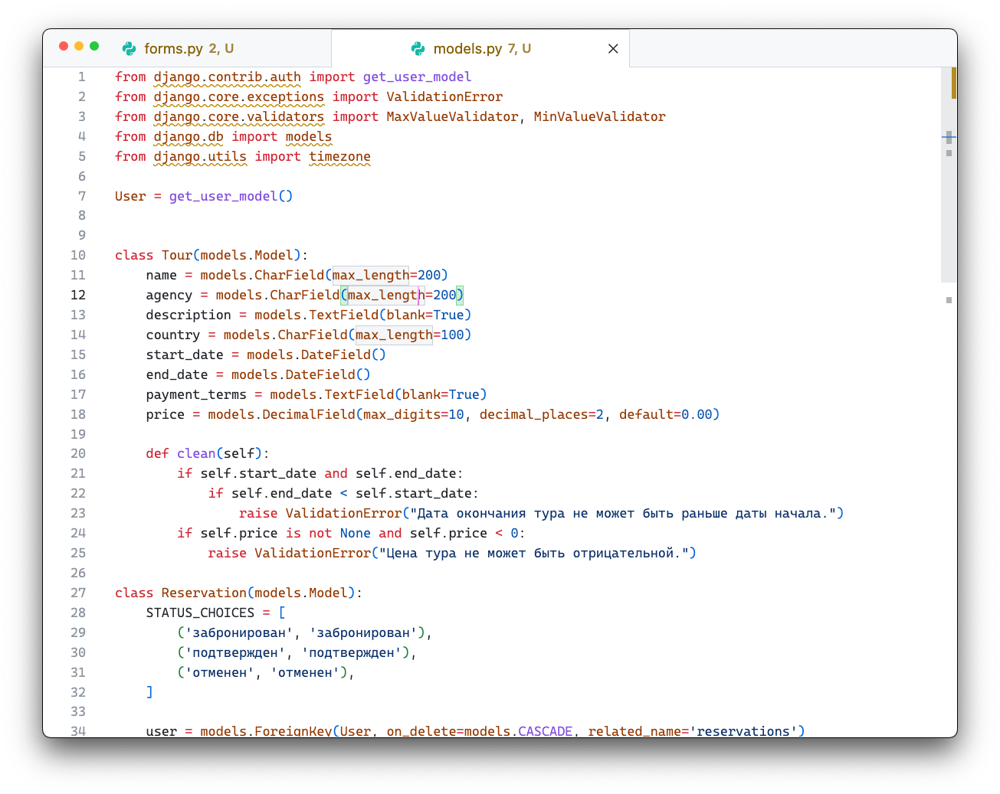
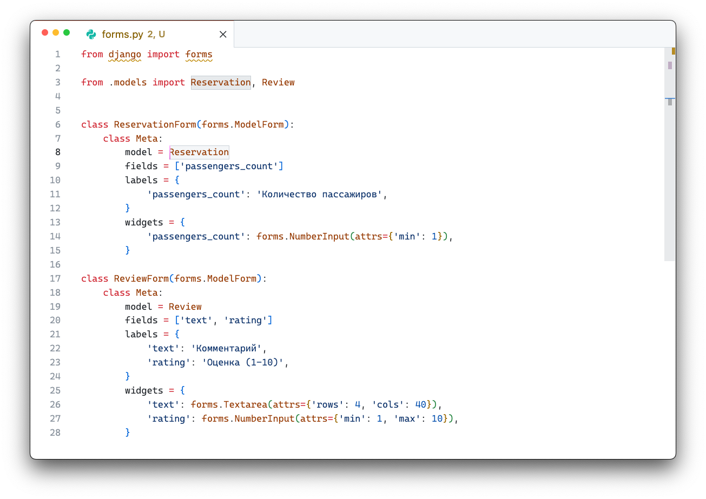
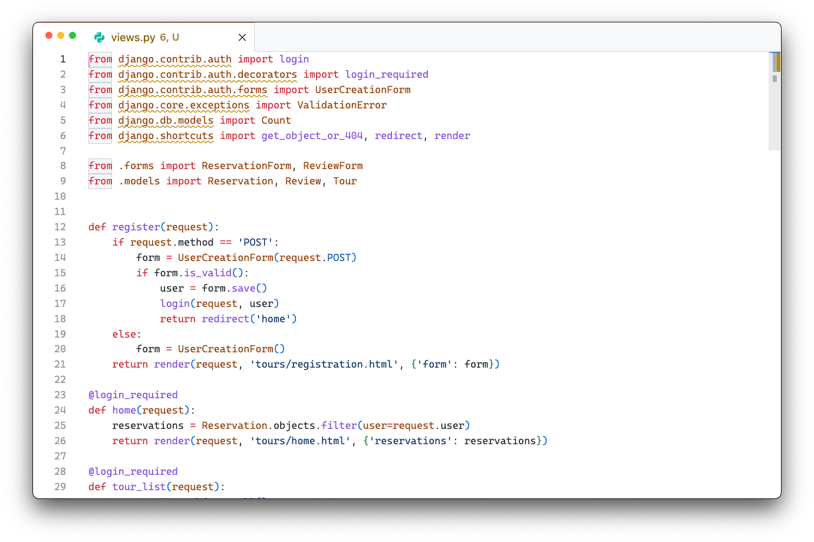

# Лабораторная работа: Система туристических туров на Django

В этой лабораторной работе я разработал веб-приложение для туристической фирмы. Оно позволяет пользователям регистрироваться, просматривать доступные туры, резервировать их, оставлять отзывы и видеть статистику проданных туров по странам. Администратор может подтверждать бронирования через Django-admin.

---

## Ход выполнения

Сначала я создал модели данных. Модель `Tour` хранит основную информацию о турах: название, турагентство, описание, страну проведения, даты начала и окончания, условия оплаты и цену. Модель `Reservation` отвечает за бронирование тура пользователем и содержит информацию о пользователе, туре, количестве пассажиров, статусе брони и датах создания и обновления. Модель `Review` хранит отзывы о турах, включая пользователя, тур, даты тура, текст комментария и рейтинг от 1 до 10. Были добавлены ограничения и валидаторы

После этого я сделал формы для работы с моделями. Форма `ReservationForm` содержит поле для количества пассажиров. Форма `ReviewForm` позволяет пользователю добавлять комментарий и оценку к туру.

Далее я реализовал пользовательский функционал. Регистрация новых пользователей проходит через стандартную форму Django `UserCreationForm`, а вход и выход осуществляются через встроенные представления LoginView и LogoutView. После авторизации пользователи могут просматривать список всех туров и переходить на страницу деталей конкретного тура, где отображаются отзывы и бронирования. Бронирование можно редактировать и удалять. 

В сайте предусмотрены следующие ручки: главная страница отображается по адресу `/`, список всех туров — по `/tours/`, регистрация новых пользователей — по `/register/`. Для входа и выхода я использовал встроенные представления Django `LoginView` и `LogoutView`. Страницы деталей конкретного тура доступны по адресу `/tour/<id>/`, резервирование тура — `/reserve/<id>/`, добавление отзыва — `/review/<id>/`. Кроме того, я добавил маршруты для редактирования и удаления бронирований, а также для просмотра таблицы проданных туров по странам.

Рассмотрим представления. Для регистрации я сделал функцию `register`, которая обрабатывает POST-запрос с формой `UserCreationForm`. Если данные корректны, создаётся новый пользователь, и он автоматически логинится.  

Главная страница (`home`) показывает пользователю все его бронирования. В функции `tour_list` я получаю список всех туров и передаю его в шаблон для отображения. Для просмотра деталей конкретного тура я сделал `tour_detail`, где показываются сама информация о туре, отзывы и существующие бронирования.

Для бронирования тура я сделал функцию `reserve_tour`. Она обрабатывает форму `ReservationForm`, проверяет корректность введённых данных через `full_clean()`, и если всё верно, сохраняет бронирование. Редактирование и удаление бронирований реализованы через `edit_reservation` и `delete_reservation` соответственно, с проверкой, что пользователь может менять только свои бронирования.  

Добавление отзывов я реализовал в `submit_review`. При создании нового отзыва автоматически подставляются даты тура, а затем отзыв сохраняется вместе с текстом и рейтингом.  

Для статистики проданных туров я написал `sold_tours_by_country`, где с помощью Django ORM агрегируются бронирования с подтверждённым статусом по странам. Полученные данные передаются в шаблон, где формируется таблица.  

Для администратора я настроил Django-admin. Через панель администрирования можно подтверждать бронирования туров.

