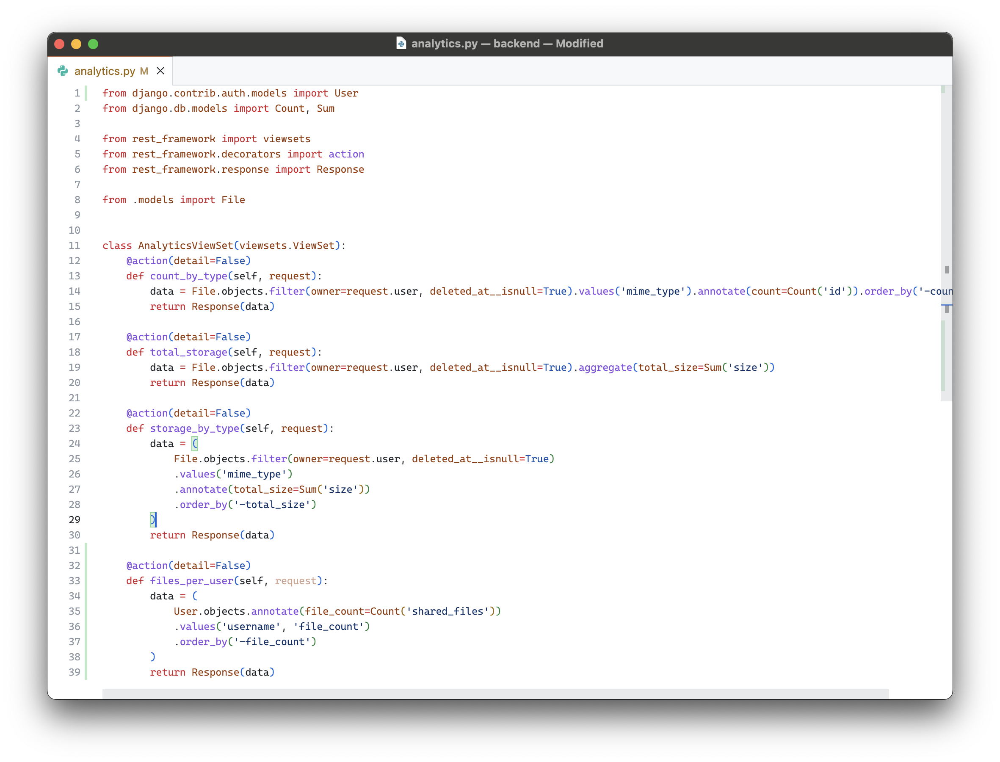

# Лабораторная работа: Облачное файловое хранилище на Django и DRF

В рамках лабораторной работы я разработал облачное файловое хранилище на Django с использованием Django REST Framework.  
Система реализует хранение метаинформации о файлах, авторизацию пользователей и REST API для взаимодействия с контентом.  
Проект позволяет загружать, организовывать и безопасно делиться файлами между пользователями, а также управлять доступом через временные ссылки.

---

## Ход выполнения

### 1. Проектирование и создание моделей данных

Сначала была спроектирована база данных для хранения информации о файлах и папках.  
Основные сущности:  
- **Folder** — папка, принадлежащая пользователю, может иметь родительскую папку (реализовано через `ForeignKey` на саму себя).  
- **File** — отдельный загруженный файл с информацией о размере, типе MIME, дате загрузки, ссылке на превью и принадлежности к пользователю и папке.  
- **SharedLink** — временная ссылка на файл, обеспечивающая безопасный доступ с ограничением по времени и количеству скачиваний.  

---

### 2. Реализация API с помощью Django REST Framework

После описания моделей я реализовал REST API для управления файлами и папками.  
В API предусмотрены следующие возможности:
- получение списка файлов и папок;
- загрузка и массовая загрузка файлов;
- перемещение файлов между папками;
- удаление файлов (реализовано мягкое удаление через поле `deleted_at`);
- скачивание и просмотр превью через Nginx с `X-Accel-Redirect`;
- создание временных ссылок для шаринга.  

Каждый запрос проверяет права доступа через кастомное разрешение `IsOwner`, чтобы пользователи могли работать только со своими файлами и каталогами.

---

### 3. Подключение авторизации через Djoser и JWT

Для регистрации и аутентификации пользователей я подключил библиотеку **Djoser** с поддержкой JWT-токенов.  
Пользователи могут создавать учётные записи, входить в систему, обновлять токены и получать информацию о текущем пользователе.  
Это позволило реализовать безопасный REST API, в котором каждый пользователь имеет собственное файловое пространство.

---

### 4. Генерация превью и асинхронная обработка файлов

Для изображений и видео реализована система генерации превью.  
Я создал асинхронную задачу `generate_preview`, которая выполняется через **Celery**.  
Для изображений используется библиотека **Pillow**, а для видео — **ffmpeg**, где из видеофайла извлекается кадр и сохраняется как превью.  
Готовое изображение сохраняется в папке `previews`, а путь к нему прописывается в поле `preview_image`.

---

### 5. Реализация аналитики и агрегационных запросов

Для демонстрации работы ORM я реализовал три агрегирующих запроса в отдельном модуле **analytics**:
1. Подсчёт общего объёма файлов, загруженных каждым пользователем.
2. Определение наиболее часто загружаемых типов MIME.
3. Подсчёт количества активных публичных ссылок для каждого пользователя.
4. M2M эндпоинт, указывающий на пользователей, которым предоставлен доступ
Результаты этих запросов используются в административной панели для отображения статистики работы системы.

---

### 6. Модели сериализации

Для передачи данных через API реализованы сериализаторы:
- `FileSerializer` — возвращает информацию о файле, а также ссылки для скачивания и превью;
- `FolderSerializer` — включает в себя вложенные папки и файлы (реализовано через `SerializerMethodField`);
- `SharedLinkSerializer` — сериализация временных ссылок.  

---

## Итоги работы

В результате лабораторной работы создано полноценное облачное файловое хранилище с REST API.  
Приложение реализует загрузку, хранение, организацию и безопасный доступ к файлам, поддерживает JWT-аутентификацию, генерацию превью, публичные ссылки и асинхронную обработку данных.  
